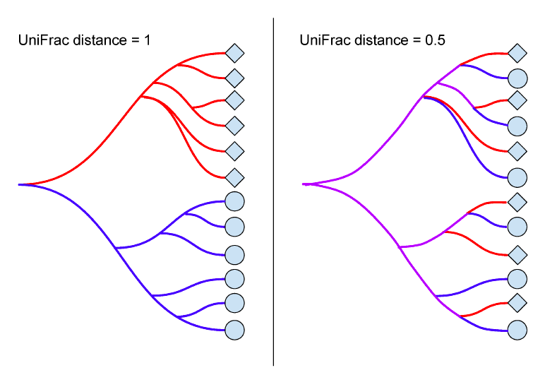
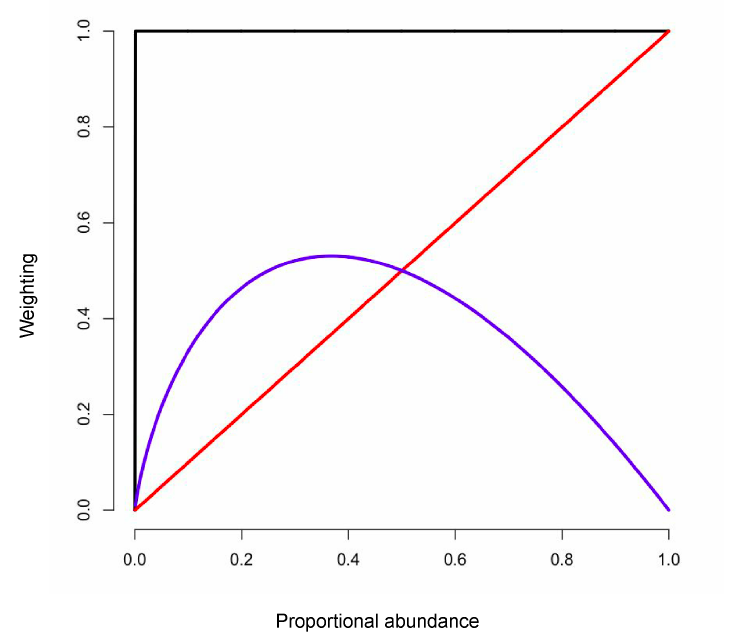

# UniFrac workshop

This workshop is about how to use UniFrac in R. It was presented at the Reid/Burton/Gloor lab Data Club on February 29, 2016. A slide deck was presented based on the draft of my [paper](expanding_the_unifrac_toolbox.pdf), submitted to the [Great Lakes Bioinformatics and the Canadian Computational Biology Conference 2016](https://www.iscb.org/glbioccbc2016). This README was then gone through to demonstrate the use of the enclosed [UniFrac R script](UniFrac.r).

## UniFrac

UniFrac is the distance between two microbiome samples. To calculate UniFrac, you need a phylogenetic tree, and a table of counts per bacterial taxa (or operational taxonomic units) per sample.

### Original (Unweighted) UniFrac

[Lozupone et al first publicized unweighted UniFrac in 2005](http://aem.asm.org/content/71/12/8228.full).



To calculate unweighted UniFrac, you take the branches of the phylogenetic tree that are not shared between the two samples and and divide that by the total branch lengths.

### Weighted UniFrac

In 2007, Lozupone et al published an [exciting modification on unweighted UniFrac](http://aem.asm.org/content/73/5/1576.long), where the branches of the phylogenetic tree are weighted by the difference in taxa abundance.

Weighted UniFrac is calculated as follows:


### Information UniFrac

Information UniFrac weights tree branches by uncertainty. A 50/50 composition is more uncertain than a 90/10 composition. This incorporates the taxa abundance evenness. We introduce Information UniFrac in our [conference paper](expanding_the_unifrac_toolbox.pdf).

The weighting for Information Unifrac is calculated as follows, where `p` is the proportion of the taxa, and the logarithm is base 2:

```
p*log(p)
```

Here's a depiction of unweighted (black line), weighted (red line), and information (blue line) UniFrac weightings. The x-axis is the taxa abundance, and the y-axis is the corresponding weight.



### Ratio UniFrac

Ratio UniFrac is weighted by taxa abundance, except that the taxa abundance are divided by the geometric mean of all the taxa abundances in the sample. The geometric mean serves as a baseline taxa abundance. We introduce Ratio UniFrac in our [conference paper](expanding_the_unifrac_toolbox.pdf).

Ratio UniFrac is calculated as follows:


## When to use different types of UniFrac

You should use all of them!

* Unweighted UniFrac is good at showing you when you have low level trends, usually indicative of some sort of contaminant. See the barcode example in the slides, where the samples separate according to which row of the 96 well plate they were on.
* Weighted UniFrac is the classic tool used in a lot of microbiome research. If you use any of the below methods, you should also use weighted for comparison. Weighted UniFrac shows you separation proportional to abundance differences for taxa between samples.
* Information UniFrac takes into account the abundance evenness of the whole sample, and can differentiate some outliers missed by classically weighted UniFrac.
* Ratio UniFrac takes into account the baseline abundance of taxa, and can also differentiate some outliers missed by classically weighted UniFrac.

If you have a clear difference between your groups, all the different UniFrac methods will show it. If you have a very small difference between groups, it is possible that you will get misleading results with Unweighted Unifrac, which can vary with rarefaction instance. If you have a middling difference, or outliers, it's good to examine the results from each type of UniFrac and make conclusions based on the way the tool works.

## Using the scripts

### Downloading

Here are three different ways to put these files on your computer.

#### Downloading from the web

#### Downloading using GitHub Desktop

#### Downloading using GitHub on the command line

### Installing

Running the UniFrac script requires an installation of R. You will also need the packages phangorn, zCompositions, and vegan, which you can install from CRAN as follows inside R. Pick a CRAN mirror when prompted (on my computer sometimes it takes a minute for this dialog to pop up).

```
install.packages("phangorn")
install.packages("zCompositions")
install.packages("vegan")
```

### Running

#### Example code

#### Customizing the example code

### Troubleshooting

When you're getting an error

* look at your data
 * sometimes a previous step messed up and now your data is all NA or NaN
 * sometimes you've run a filter that's too aggressive and now most of your data is gone
* run things line by line, checking the results as you go along
 * str(myDataFrame) will show you what's inside your R things
 * head(myDataFrame) and tail(myDataFrame) can be used to check the beginning and the end
 * names(myDataFrame) will show you what the column and row names are, so you can make sure it makes sense
 * summary(myVector) will show you where the minimum, maximum, median, mean, and first and 3rd quartile of your data are.
 


